<style>
h1 {
    text-align: center;
}
h2, h3 {
    page-break-after: avoid; 
}
.center {
    margin: 0 auto;
    width: fit-content;
    margin-top: 2em;
    padding-top: 0.5em;
    padding-bottom: 0.5em;
    margin-bottom: 2em;
}
.title {
    font-weight: bold;
    border-top-style: solid;
    border-bottom-style: solid;
}
.newpage {
    page-break-after: always
}
@media print {
    @page {
        margin: 3cm;
    }
}
</style>

<h1 style="margin-top: 4em">
高级机器学习作业
</h1>

# <h1 class="center title">PDR: 室内行人移动方位推算技术</h1>

<div class="center">
<h3>院系：人工智能学院</h3>
<h3>组长：方盛俊 (201300035)</h3>
<h3>组员：任圣杰 (201300036)<br />&nbsp;&nbsp;&nbsp;&nbsp;&nbsp;&nbsp;&nbsp;&nbsp;&nbsp;&nbsp;&nbsp;曹明隽 (201300031)</h3>
<h3>邮箱：201300035@smail.nju.edu.cn</h3>
<h3>时间：2022 年 11 月 30 日</h3>
</div>

<div class="newpage"></div>

<!-- 生成目录 -->

## <h1>目录</h1>

[TOC]

<div class="newpage"></div>

<!-- 文章主体内容 -->

## 一、问题描述

### 1.1 问题背景

室内 GPS 信号受到阻隔，尤其时车库场景无线接入点 AP 较为稀疏，室内定位很难通过 GPS 或位置指纹等技术实现。行人行位推算技术（Pedestrian Dead Reckoning，PDR）可以有效解决这一问题，它利用手机内置传感器收集数据，通过轻量级低功耗算法运行框架和技术，实现稳定可靠、高精度的方位推算计算。

### 1.2  输入

输入为 CSV 格式，其每一行都有数据值及采集到该数据时的时间（从开始收集计算），以加速度计为例：

```csv
"Time (s)","Acceleration x (m/s^2)","Acceleration y (m/s^2)",
"Acceleration z (m/s^2)"
9.364549000E-3,1.003170490E0,3.543418407E0,7.366958618E0
1.136538300E-2,9.696516991E-1,3.600879431E0,7.357381821E0
1.336699700E-2,9.696516991E-1,3.620033026E0,7.343016624E0
```

输入数据包括：

1. `Accelerometer.csv, Linear Accelerometer.csv`：50Hz 采集的加速度和线加速度，单位为 $m/s^2$
2. `Magnetometer.csv`：50Hz 采集的磁力计读数，单位为 $\mu\text{T}$
3. `Gyroscope.csv`：50Hz 采集的陀螺仪读数，单位为 $\text{rad}/s$
4. `Location_input.csv`：前 10% 时间的 1Hz 的 GPS 位置读数：
   1. 经纬度 `Latitude, Longitude`，单位为 $\degree$
   2. 高度 `Height`，单位为 $m$
   3. 速度 `Velocity`，单位为 $m/s$
   4. 方位角 `Direction`，单位为 $\degree$
   5. 垂直和水平精度 `Horizontal Accuracy, Vertical Accuracy`，单位为 $m$

其中加速度、线加速度、磁力计、陀螺仪均有三个维度上的读数：

<div style="text-align: center;">
    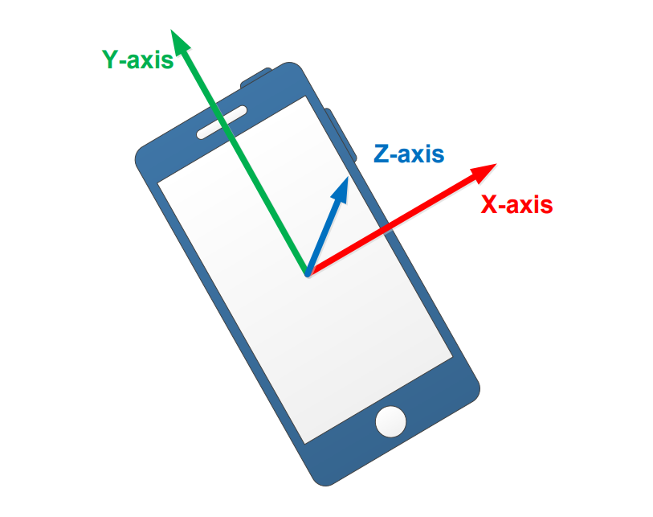
</div>
<div style="text-align: center; font-size: small">
    <b>Figure 1.1</b> 数据的三个维度
    <br />
    <br />
</div>


### 1.3 输出

输出为后 90% 时间的 1Hz 的 GPS 位置读数中的经纬度和方位角，即不需要输出速度、高度和精度。

输出也是 CSV 格式。输出文件 `Location_output.csv` 的前 10% 将复制 `Location_input.csv` ，并填充其后 90% 的经纬度和方位角。

**文档要求：**

- **统一使用中文标点符号；**
- **中文和英文之间要隔一个空格；**
- **每一个段落空一行。**
- **图片统一保存在 `./images` 文件夹下**


## 二、数据收集与处理

### 2.1 数据收集

数据收集工作由多组合作完成，使用软件 phyphox（中文名：手机物理工坊）。

针对室内场景，我们在多种设备上收集并使用了以下三种状态采集到的数据：

1. 步行，手机拿在手上，共 49 组
3. 步行，手机放在背包内，共 4 组
1. 步行，手机放在裤兜内，共 12 组

每种数据都收集了多组。在单次收集过程中，手机大部分时间保持在同一个状态下。

此外我们还收集了一些不太可能出现在室内的运动状态，用于测试模型的迁移性能：

1. 骑车，手机拿在手上，共 5 组
2. 骑车，手机放在背包内，共 1 组
3. 跑步，手机放在裤兜内，共 4 组
4. 骑车，手机放在裤兜内，共 7 组


### 2.2 数据划分

由于模型的特点，我们没有使用训练集，不需要进行数据划分，收集的所有数据都用于测试。


## 三、总体思路

### 3.1 前期思考

（方盛俊）

经过分析，我们发现 PDR 算法的关键只有两点：

1. 如何预测出任给一个时间点的已走过的 **路程**。
1. 如何预测出任给一个时间点的对应 **前进方向**。

我们很容易猜想 **路程** 在 **理论上** 应该是通过 **加速计加速度** 二重积分得到的，方向应该是经过 **陀螺仪角速度** 一重积分得到的。

但是事实上理论和实践有着很大的差距，我们测量出来的 **加速度** 和 **角速度** 总是在不断的振荡，与真实数据存在非常大的误差，这是因为：

1. 手机并不是固定在人的身上的，例如手机拿在手上时，就会随着手的活动不断摇摆振荡；
2. 手机自带的加速度计和陀螺仪就存在着一定的误差。

所以根据积分来计算出路程和方向的想法是不可行的，我们需要思考准确性和稳定性更强的方案。

这里我们发现：

1. 加速度的幅值的振荡频率和行人的步伐振荡频率强相关；
2. 磁力计的磁场强度与前进方向强相关（磁场强度方向指向北方）；
3. 我们拥有前 10% 的数据，可以从中学得很多有用的信息，比如每走一步的长度，再比如初始的前进方向。

根据这三个线索，我们制定了下面的 PDR 算法思路。


### 3.2 二级标题

### 3.1.1 三级标题

总体思路为步伐检测和方向预测。（任圣杰、方盛俊)

公式：

$$
\begin{equation}
    \begin{cases}
        X_k = X_{k-1} + L_{k-1,k} \cdot \cos(\theta_{k-1, k}) \\
        Y_k = Y_{k-1} + L_{k-1,k} \cdot \sin(\theta_{k-1, k}) \\
    \end{cases}
\end{equation}
$$

模型使用的算法没有限制，可以自行选择自己认为合理的算法。比如，可以直接把这个任务看成一个线性或者非线性的回归问题，也可以将此任务看成一个时间序列预测的问题，或者训练模型分别预测移动方向和移动速度，从而计算出当前位置，亦或利用强化学习解决这个问题等。但需要在实验报告中体现出该方法的合理性。


## 四、数据预处理

### 4.1 经纬度转换

由于输入和输出的位置信息是以经纬度为准的，而经纬度作为位置信息有一些缺点：

1. 经纬度是绝对位置，不是相对位置，后续处理比较困难；
1. 经纬度的单位长度的实际物理长度过大，比如经纬度的一度可能就对应着几十或上百公里，而我们实际的行走范围可能不会超过一公里；
2. 经纬度是在球形地球的假设上进行计算的，难以直接转换成以米为单位，也难以转到平面坐标系。

针对上面问题，我们使用了一个公式：

$$
\begin{equation}
    \begin{cases}
        X_k = K \cdot (\mathrm{latitude}_k - \mathrm{latitude\_origin}) \\
        Y_k = K \cdot (\mathrm{longitude}_k - \mathrm{longitude\_origin}) \\
    \end{cases}
\end{equation}
$$

对经纬度进行转换，其中 $K = 10^{5}$，而 $\mathrm{latitude\_origin}$ 和 $\mathrm{longitude\_origin}$ 为我们选定的初始坐标点，这里我们选用了第 10% 行数据对应的经纬度为初始坐标点。

而 $K = 10^{5}$ 是为了将数据放大到和单位米相同的数量级，由于我们的运动范围较小，因此我们可以直接忽略球形地球假设，直接使用平面坐标系。


<div style="text-align: center;">
    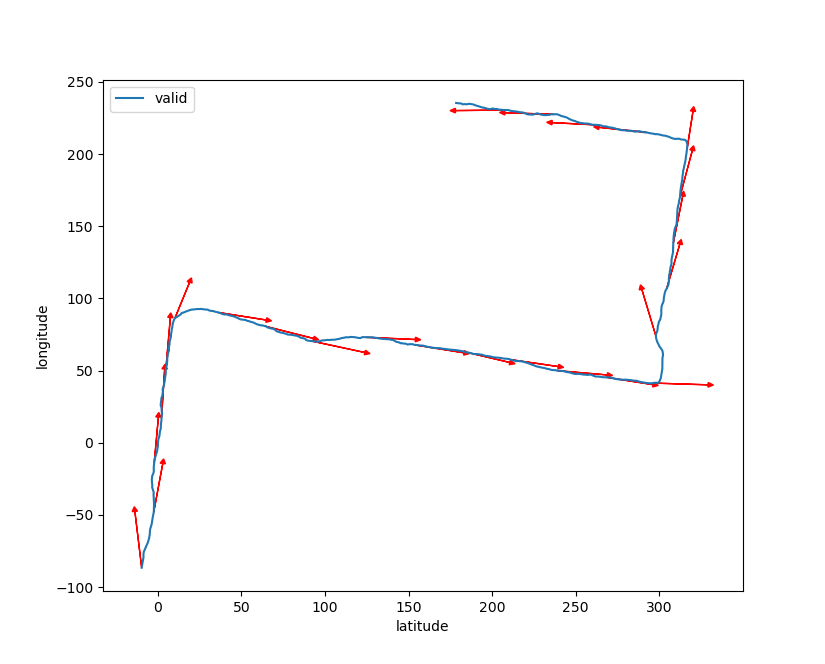
</div>
<div style="text-align: center; font-size: small">
    <b>Figure 4.1</b> 以 X 为横坐标，以 Y 为纵坐标得到的平面坐标系图
    <br />
    <br />
</div>

经过经纬度转换后，我们使用 $X$ 和 $Y$ 的数据画出 `test_case0` 对应平面坐标系，并且每隔一段画出对应的前进方向的箭头，我们可以看出前进方向和我们转换后的 $X$ 和 $Y$ 依旧是吻合的。

### 4.2 最近邻插值对齐数据

我们的输入有五个文件（忽略气压计数据），分别为：

- `Accelerometer.csv`（加速度计数据，50 Hz）
- `Linear Accelerometer.csv`（线性加速度计数据，50 Hz）
- `Gyroscope.csv`（陀螺仪数据，50 Hz）
- `Magnetometer.csv`（磁力计数据，50 Hz）
- `Location_input.csv`（GPS 位置信息，1 Hz）

可以看出，GPS 位置信息和其他的输入数据的频率并不相同，它们的频率 **在理论上** 是 1: 50 的关系。但是由于每个传感器的周期并不完全同步，也存在着时钟周期误差的影响，最后导致实际记录的数据实际上并不是严格 1: 50 对齐的，有可能每一个文件的数据长度都各不相同。

数据不对齐以及长度不一致的话，在数据处理和计算时会造成各种错误，甚至代码无法执行，所以我们首先一个很重要的任务就是对齐数据，让它们数据长度严格保证是 1: 50 的比例，且在时间轴上（或者说在同一个下标下）严格对齐。

在这里，我们使用了最近邻插值的方法，以 `Location_input.csv` 的时间轴为基准，进行了最近邻插值，对数据进行了对齐处理。大致算法如下：

1. 将 `Location_input.csv` 的 1 Hz 的时间轴 `time_location` 线性扩充成 50 Hz 的时间轴 `time`, 例如 `time_locaiton = [1., 2.]` 的话，便会扩充成 `time = [1., 1.02, 1.04, ..., 1.98, 2., 2.02, 2.04, ..., 2.98]`, 其中 `len(time) = 100`。
2. 将其他 50 Hz 的数据通过最近邻插值对齐到 `time` 时间轴上，最近邻插值即为每一个点匹配到最近的样本点。例如 `Accelerometer.csv` 的数据 `[[1.01, 1], [1.02, 2], [1.03, 3], [1.04, 4]]` 可能就会被最近邻插值为 `[[1.00, 1], [1.02, 2], [1.04, 4]]`。

通过最近邻插值，我们就能保证数据是严格的 1: 50 沿着时间轴对齐了。例如 `test_case` 的数据经过数据预处理后的尺寸如下：

```python
test_case.time_location.shape = (601,)
test_case.time.shape = (30050,)
```

### 4.3 对应的代码以及 TestCase 接口

最近邻插值的代码为：

```python
def nearest_neighbor_interpolation(time, time_data, data):
    '''
    使用最近邻插值获取新的 data_interp
    '''
    data_interp = []
    # 当前下标 i
    i = 0
    for t in time:
        while i < len(time_data) - 1 and t >= time_data[i + 1]:
            i += 1
        data_interp.append(data[i])
    return np.array(data_interp)
```

我们封装了一个类 `TestCase`，用于加载数据、数据预处理、数据抽象和数据保存。`TestCase` 类保存在 `dataloader.py` 文件下，部分接口如下：

```python
# 通过文件路径加载一个 TestCase 
test_case = TestCase("test_case0")
# 可以对 TestCase 进行切片, 单位为秒
new_test_case = test_case.slice(100, 500)
# 1 Hz 的时间轴
print(test_case.time_location)
# 50 Hz 的时间轴
print(test_case.time)
```

```python
# 加速度数据
print(test_case.a)
print(test_case.a_x)
print(test_case.a_y)
print(test_case.a_z)
# 加速度幅值
print(test_case.a_mag)
# 磁力计数据
print(test_case.m)
print(test_case.m_x)
print(test_case.m_y)
print(test_case.m_z)
```

```python
# 必然存在的前 10% 的数据 (Location_input.csv)
print(test_case.x)
print(test_case.y)
print(test_case.direction)
# 对应的长度
print(test_case.len_input)
# 可能存在的验证数据 (Location.csv)
if test_case.have_location_valid:
    print(test_case.x_valid)
    print(test_case.y_valid)
    print(test_case.direction_valid)
# 可能存在的输出数据 (Location_output.csv)
if test_case.have_location_output:
    print(test_case.x_output)
    print(test_case.y_output)
    print(test_case.direction_output)
```

```python
# 将结果存储到 test_case 中, 会保存成 "Location_output.csv" 文件
test_case.set_location_output(x_output, y_output, direction_output)
# 评估模型, 输出 Distances error, Direction error, Direction ratio
test_case.eval_model()
# 画出 test_case 的路线图像
test_case.draw_route()
```

并且在数据预处理后，还会输出一个对齐了的数据对应的 CSV 文件 `preprocessed.csv`，格式大致为：

```csv
t,a_x,a_y,a_z,la_x,la_y,la_z,gs_x,gs_y,gs_z,m_x,m_y,m_z
0.0,-1.2,5.2,8.2,-0.4,-0.0,-0.2,-0.2,0.4,0.1,-31.0,-22.4,-29.8
0.0,-1.2,5.2,8.2,-0.4,-0.0,-0.2,-0.2,0.4,0.1,-31.0,-22.4,-29.8
```


## 五、步伐检测

步伐检测主要分为两个部分：

1. 脚步提取：行人何时向前迈了一步
2. 步幅估计：向前迈的一步有多长

### 5.1 脚步提取

手机在行人行走时会产生周期性晃动，加速度计数据可以反映步数特征。设备姿态的变化会影响三个轴上的加速度值，为了避免这种影响，选择加速度`a_mag`的大小作为阶跃检测的标准。

$$
\text{a\_mag} = \sqrt{a_x^2 + a_y^2+a_z^2}
$$

使用 `test_case0` 中的部分时间段内的加速度幅度作为处理示例，未经处理的数据如下：

<div style="text-align: center;">
    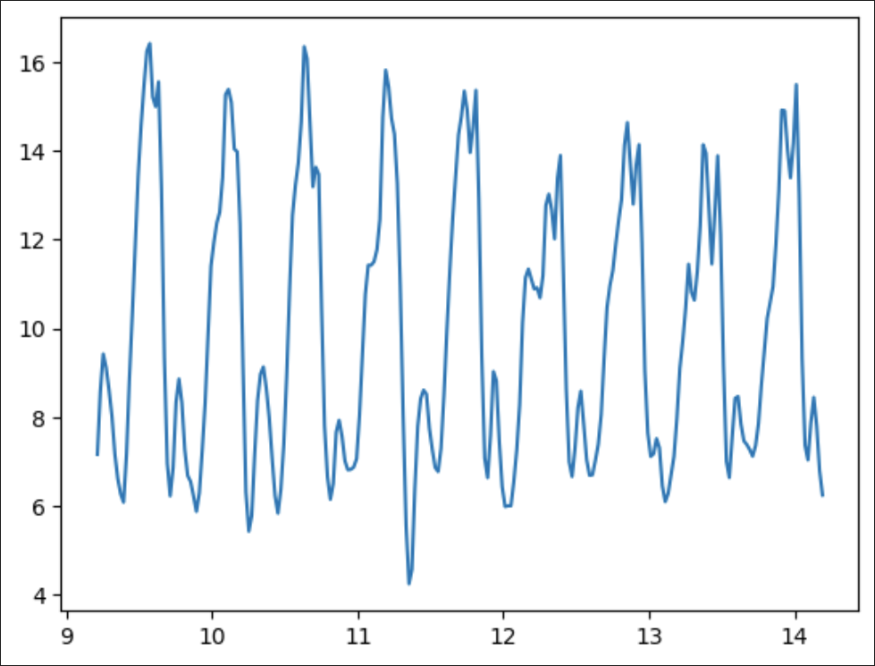
</div>
<div style="text-align: center; font-size: small">
    <b>Figure 5.1</b> 加速度 a_mag 波动图
    <br />
    <br />
</div>

通过肉眼可以清晰的看出加速度的震荡具有规律性，较大峰值个数表示行人的可能步数。接着进行处理：

#### 5.1.1 滤波器处理

此时先用滤波器进行滤波，将波动变得更加光滑，消除小波峰:

代码：

```python
### 滤波器
def filter(range,data):
    filter = np.ones(range) / range
    return np.convolve(data, filter, mode="same")

new_test_case = test_case.slice(10, 15)
### 对 a_mag 进行滤波
filtered_a = filter(10,new_test_case.a_mag)
```

滤波效果：

<div style="text-align: center;">
    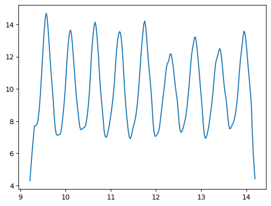
</div>
<div style="text-align: center; font-size: small">
    <b>Figure 5.1</b> 加速度 a_mag 波动图
    <br />
    <br />
</div>

#### 5.1.2 步长间隔选择

一般人的步频最大为 3 Hz ，设定0.4秒的间隔查找峰值，如果含有多个峰值，则其中含有假峰，选取波峰最大的那一个。

波峰采集效果：

<div style="text-align: center;">
    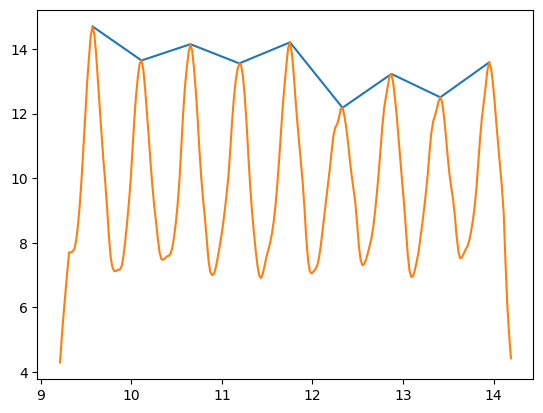
</div>
<div style="text-align: center; font-size: small">
    <b>Figure 5.1</b> 加速度 a_mag 波动图
    <br />
    <br />
</div>

#### 5.1.3 候选锋检测

在选取好候选波峰后，其中依然可能含有假波峰，例如行人行走过程中突然停下来，停下来的期间不可避免的会有微小振动，而这些振动中的波峰也会被识别到。此时对所有候选波峰求平均，并保留大于 平均值*0.8 的部分。

### 5.2 步幅估计

在原始数据中，我们已经拥有了经纬度坐标，借此我们可以计算出经纬度坐标间的距离；同时，我们也进行了脚步提取，知道什么时间迈出了一步。此时就需要通过前百分之十的数据，对步幅进行一个估计。

在预测前，我们发现并不知道行人每一步迈出的具体长度；而脚步波峰对应的时间 与 经纬度坐标的时间没有对齐，实际情况为：

<div style="text-align: center;">
    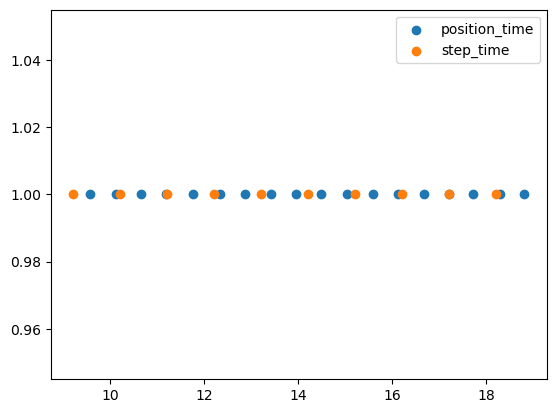
</div>
<div style="text-align: center; font-size: small">
    <b>Figure 5.1</b> 加速度 a_mag 波动图
    <br />
    <br />
</div>


尝试使用了哪些方法，为什么使用这些方法，方法的效果怎么样，如果效果不好，可能的原因时什么，如何解决这些问题。以及在迁移场景的完成情况。（任圣杰）

## 六、方向预测

### 6.1 方向预测所需数据

为了实现准确且稳定的前进方向预测功能，这里我们主要使用了三类数据：

- **磁力计数据**（Magnetometer）：北半球磁场方向始终指向北偏下，因此磁力计数据是预测前进方向的核心；
- **加速度计中的重力加速度数据**（Accelerometer）：我们对加速度计测出来的加速度进行处理，便能得到重力加速度数据，重力加速度数据是确定手机坐标轴朝向的核心；
- **GPS 位置中前 10% 的前进方向数据**（Location_input）：我们可以通过前 10% 的前进方向数据。

注意，这里我们并没有用到陀螺仪的数据，因为陀螺仪测出来的是角速度，很容易被手机的摇摆振荡的角速度变化干扰，因此陀螺仪的数据几乎是不可用的，这里我们就舍弃了这个数据。

### 6.2 低通滤波过滤手机自身振荡

磁力计和加速度计记录的数据，会随着手机自身的摇摆而不断地振荡。这种振荡是不可避免的，因为它来源于：

1. 行人行走时将手机拿在手上，手机随着手的摆动而振荡；
2. 行人行走时将手机放在口袋里，手机随着大腿的摆动而振荡；
1. 行人行走时将手机固定在某一位置（如打电话固定在耳旁），手机也依然会因为行走本身就不是匀速的，因而发生振荡。

<div style="text-align: center;">
    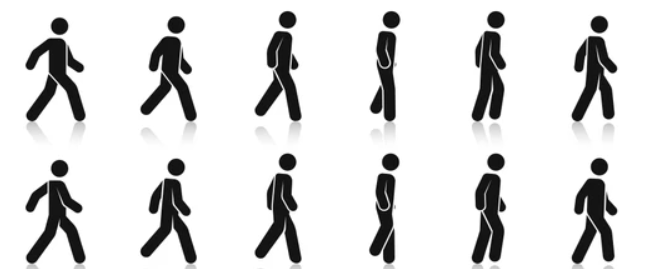
</div>
<div style="text-align: center; font-size: small">
    <b>Figure 6.1</b> 人的行走会引起振荡
    <br />
    <br />
</div>

手机的摇摆会引起手机坐标轴发生变化，进而导致测出来的磁力和加速度数据在 xyz 三个轴上不断地振荡变化。

为了消除这种振荡，我使用了一个截止频率相关参数 `Wn` 大致在 0.005 左右的 2 阶 **Butterworth 低通滤波器**，将磁力和加速度进行低通滤波，得到了更为平滑的磁力和加速度数据。由于加速度经过了低通滤波，几乎就等于被取了平均值，和重力无关的加速度被抵消，因此此时我们有 **加速度 $a$ 等于重力加速度 $g$**。

这里有一点很有趣的事实，除了这种对加速度低通滤波得到重力加速度的方法外，我们还可以通过 **加速度计数据减去线性加速度计数据** 这种方法，得到重力加速度 $g$，只不过依然需要滤波。

$$
\begin{equation}
    \begin{cases}
        g \approx \operatorname{lowass}(a) \\
        g \approx \operatorname{lowass}(a - la) \\
    \end{cases}
\end{equation}
$$

滤波器的代码为：

```python
b, a = signal.butter(2, 0.005, 'lowpass')
m_x = signal.filtfilt(b, a, tc.m_x)
m_y = signal.filtfilt(b, a, tc.m_y)
m_z = signal.filtfilt(b, a, tc.m_z)
```

由图便可看出，经过低通滤波后的磁力和加速度均平缓了很多，可以直接用于后续的方向预测了。

<div style="text-align: center;">
    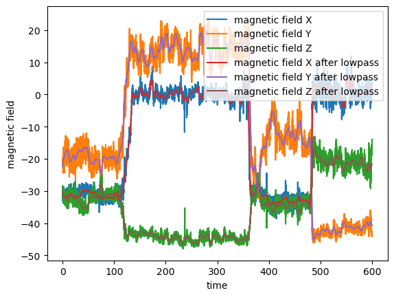
</div>
<div style="text-align: center; font-size: small">
    <b>Figure 6.2</b> 磁力计数据低通滤波
    <br />
    <br />
</div>

<div style="text-align: center;">
    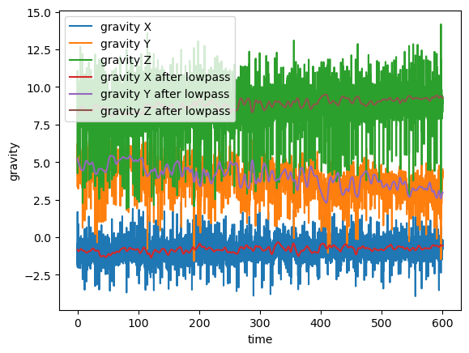
</div>
<div style="text-align: center; font-size: small">
    <b>Figure 6.3</b> 加速度计数据低通滤波（滤波后等于重力加速度）
    <br />
    <br />
</div>

这里有很关键的一点，这是作业文档中提到的一个假设，并且也是我们后续进行方向预测的核心假设：**在实验过程中，手机大部分时间保持在同一个状态下（如一直拿在手上）**。

有了这个假设，我们就可以推出一个更强的结论：**经过低通滤波后的数据，可以等同于，手机相对于人没有发生任何旋转、位移与振荡时（即完全固定），记录下来的数据。**

<div style="text-align: center;">
    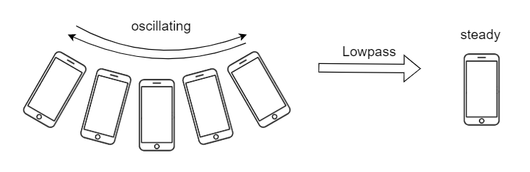
</div>
<div style="text-align: center; font-size: small">
    <b>Figure 6.4</b> 手机经过低通滤波后不再振荡，可以认为相对于人来说位置和方向是固定的
    <br />
    <br />
</div>

借助这个结论，我们就可以使用空间解析几何的方法，通过磁力计等数据预测出当前的前进方向。

### 6.3 空间解析几何预测偏转角度

首先我们有两个很重要的前提：

1. **磁力计测出来的数据，是在手机坐标系下的一系列向量，并且该向量方向总是指向北偏下；**
2. **重力加速度，是在手机坐标系下的一系列向量，并且该向量方向总是指向下。**

<div style="text-align: center;">
    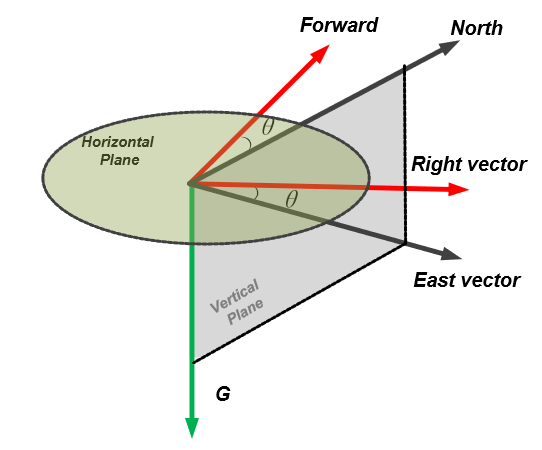
</div>
<div style="text-align: center; font-size: small">
    <b>Figure 6.5</b> 部分向量之间的关系，从论文 [1] 中截取
    <br />
    <br />
</div>

因此我们有以下的步骤：

第一步，首先用重力加速度向量 $g$ 和磁力向量 $m$ 叉乘得到东向量 $e$。

$$
\begin{equation}
    e = g \times m
\end{equation}
$$

第二步，选出一个初始东向量，例如这里可以选取第 10% 个东向量作为初始东向量。

$$
\begin{equation}
    e_0 = e_{10\%}
\end{equation}
$$

第三步，通过东向量与初始东向量的点乘除以模获取东向量和初始东向量的夹角，并转成角度制。

$$
\begin{equation}
    \theta = \frac{180}{\pi} \cdot \arccos\frac{e \cdot e_0}{|e||e_0|}
\end{equation}
$$

注意，此时我们并不知道 $e$ 在 $e_0$ 的左侧还是右侧，所以我们缺少一个符号。 

第四步，通过东向量与初始东向量叉乘后，与重力加速度点乘，得到对应的正负符号。

$$
\begin{equation}
    \mathrm{signs} = - \operatorname{sign}((e \times e_0) \cdot g)
\end{equation}
$$

最后，我们就得到了前进方向与 $e_0$ 对应的初始方向 $\mathrm{direction\_0}$ 的偏转角度。

$$
\begin{equation}
    \mathrm{direction\_diff} = \mathrm{signs} \cdot \theta
\end{equation}
$$

最后的前进方向就是初始方向 $\mathrm{direction\_0}$ 加上偏转角度，即

$$
\begin{equation}
    \mathrm{direction} = \mathrm{signs} \cdot \theta + \mathrm{direction\_0}
\end{equation}
$$

还要记得最后取模 $360$，以便转换到区间 $[0, 360)$ 上。

### 6.4 使用前 10% 的数据优化初始方向

选取初始东向量 $e_0$ 对应的初始方向 $\mathrm{direction\_0}$ 有两种可行的方案。

第一种是直接选用 $e_0$ 对应的第 10% 个方向数据作为初始方向 $\mathrm{direction\_0}$。这种办法的好处是计算快捷，而且不容易受到前面 $10%$ 的其他不准确数据的干扰。

第二种方法是，使用优化器，以及前 10% 的数据，最小化平均误差函数：

$$
\begin{equation}
    \operatorname{mean\_error}(x) = \operatorname{mean}(\operatorname{abs}(\mathrm{direction\_valid}, (\mathrm{signs} \cdot \theta + x)))
\end{equation}
$$

当然，这里的取绝对值函数 $\operatorname{abs}(a, b)$ 需要考虑圆周的情况，即 $0$ 度等同于 $360$ 度。

我们使用 `scipy` 的优化器，对应的优化代码为：

```python
# 平均误差
error_fn = lambda x: np.mean(
    direction_diff(direction_valid, (direction_offset + x)))
# 最小化误差获取最佳初始值
direction0 = scipy.optimize.minimize(error_fn, 0).x[0]
```

最后我们画出 `test_case0` 对应的图像，可以发现角度预测基本吻合。

<div style="text-align: center;">
    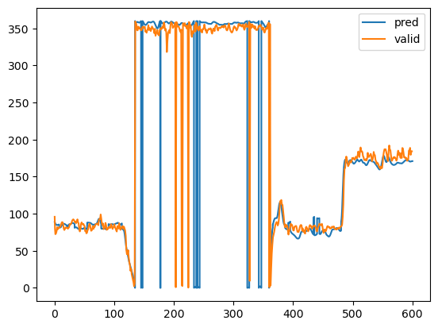
</div>
<div style="text-align: center; font-size: small">
    <b>Figure 6.6</b> test_case0 对应的真实角度和预测角度
    <br />
    <br />
</div>

### 6.5 遇到的问题和困难

我们使用的预测角度的方法有一个缺陷，就是我们依赖于一个核心假设：**在实验过程中，手机大部分时间保持在同一个状态下（如一直拿在手上）**。

如果没有这个假设，预测的前进方向角度就很难保证准确。

这是因为，如果手机没有一直保持在一个状态，而是进行了翻面等行为，则预测出来的方向则会发生极大的偏转。

这是因为，手机发生偏转后，手机坐标轴也发生了偏转，且这种偏转不能被低通滤波所抵消。由于手机坐标轴发生了恒定的偏转，理论上东向量 $e$ 也发生了恒定的偏转，这时候我们应该将其逆偏转到原来的坐标轴，才能保证与初始东向量 $e_0$ 的夹角依然是当前的前进方向。

因此我尝试过使用旋转矩阵和逆旋转矩阵来解决这个问题：

```python
def get_rotation_matrix(a, b):
    '''
    get rotation matrix from two unit vectors
    '''
    v = np.cross(a, b)
    s = np.linalg.norm(v)
    c = np.dot(a, b)
    vx = np.array([[0, -v[2], v[1]], [v[2], 0, -v[0]], [-v[1], v[0], 0]])
    return np.eye(3) + vx + vx @ vx * (1 - c) / s ** 2
```

但是最终发现还是无法解决这个问题，这便是在预测角度上所遇到的问题和困难。

由于本次实验假设： **在实验过程中，手机大部分时间保持在同一个状态下（如一直拿在手上）**。这个问题便不存在了，因此我们也没有再过多地纠结下去。


## 七、合并算法

### 7.1 统合步伐预测和角度预测

如何合并以上的代码（任圣杰）

### 7.2 线性插值获取最终预测结果

在统合了步伐预测和角度预测之后，我们需要将最后结果，通过插值的方式，对齐到 `Location_input.csv` 的 `time_location` 的时间轴上。

这里我们采用了线性插值的方式，即找到需要插值的时间点，其对应的时间轴上最近的两个样本点，通过线性函数的方式，进行线性插值。

插值函数如下：

```python
def linear_interpolation(time, time_data, data):
    '''
    使用线性插值获取新的 data_interp
    '''
    data_interp = []
    # 当前下标 i
    i = 0
    for t in time:
        while i < len(time_data) - 2 and t >= time_data[i + 1]:
            i += 1
        data_interp.append(data[i] + (data[i + 1] - data[i]) \
            / (time_data[i + 1] - time_data[i]) * (t - time_data[i]))
    return np.array(data_interp)
```

基本与最近邻插值一致，因此这里也不过多赘述。

我们将插值得到的 `x` 和 `y` 通过逆变换得到经纬度 `latitude` 和 `longitude` 后，再加上预测出来的前进方向，便得到了最后的 `Location_output.csv`。


## 八、项目代码

### 8.1 环境搭建

如何搭建环境。（曹明隽）

### 8.2 代码结构

代码结构。（方盛俊）

### 8.3 运行代码

如何运行代码。（曹明隽）

### 8.4 执行测试

如何执行测试。（曹明隽）


## 九、性能测试

在完成代码后测试，然后完成报告。（曹明隽）

### 9.1 在 test_case0 上的运行情况

包括模型推理准确性以及推理速度等。

### 9.2 在测试数据集上的运行情况

包括模型推理准确性以及推理速度等。

### 9.3 在收集数据集上的运行情况

包括模型推理准确性以及推理速度等。

### 9.4 迁移场景的完成情况

可能会和上一小节合并。


## 十、小组分工

我们小组的分工如下：

1. 搜寻论文及资料：方盛俊、任圣杰、曹明隽
2. 数据录制：方盛俊、任圣杰、曹明隽
3. 数据预处理：方盛俊
4. 步伐预测：任圣杰
5. 角度预测：方盛俊
6. 合并算法：任圣杰、方盛俊
7. 代码测试及超参数学习：曹明隽
9. 实验报告：方盛俊、任圣杰、曹明隽

此外，我们还有马潮增（201300033）的协助，他并未报上这门课程，而是旁听的这门课程。他在数据录制、角度预测等部分对我们进行了协助。


## 十一、参考文献

1. Wang, Boyuan, Xuelin Liu, Baoguo Yu, Ruicai Jia, and Xingli Gan. 2018. "Pedestrian Dead Reckoning Based on Motion Mode Recognition Using a Smartphone" Sensors 18, no. 6: 1811. https://doi.org/10.3390/s18061811

